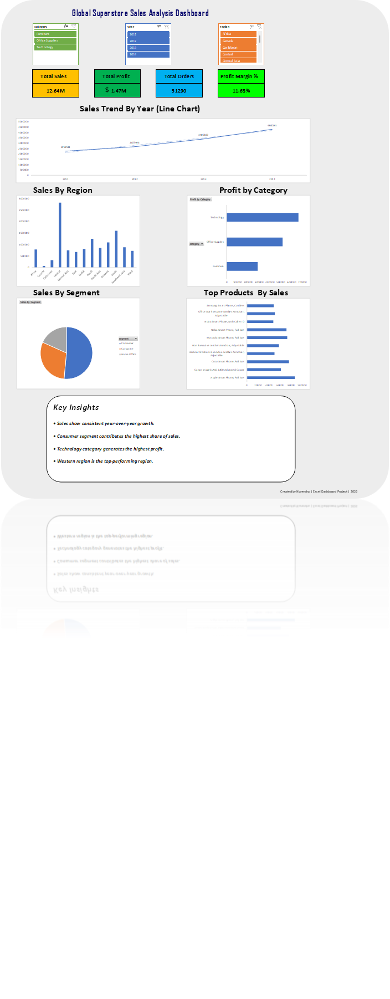

📊 Global Superstore Sales Analysis Dashboard

 📌 Project Overview

This project is an interactive Excel dashboard built using the Global Superstore dataset. The dashboard provides insights into sales performance, profitability, customer segments, regional performance, and top-selling products.

The objective of this project is to transform raw sales data into meaningful business insights through data analysis and visualization.

---

 🎯 Business Objective

The dashboard helps answer key business questions:

- How have sales changed over time?
- Which regions generate the highest sales?
- Which product categories generate the most profit?
- Which customer segment contributes the most revenue?
- What are the top-performing products?
- What is the overall profit margin of the business?

---

 🛠 Tools Used

- Microsoft Excel
- Pivot Tables
- Pivot Charts
- Slicers
- Calculated Fields
- Dashboard Design & Data Visualization

---

 📈 Dashboard KPIs

| KPI | Value |
|------|------|
| Total Sales | $12.64M |
| Total Profit | $1.47M |
| Total Orders | 51,290 |
| Profit Margin | 11.63% |

---

 📊 Dashboard Components

 1. Sales Trend by Year
- Line chart showing yearly sales growth.
- Helps identify long-term business performance.

 2. Sales by Region
- Column chart comparing sales across regions.
- Highlights top-performing and underperforming regions.

 3. Profit by Category
- Bar chart displaying profit generated by each category.
- Supports category-level decision making.

 4. Sales by Segment
- Pie chart showing contribution of customer segments.
- Helps understand customer distribution.

 5. Top Products by Sales
- Horizontal bar chart displaying highest revenue-generating products.

 6. Key Insights Section
- Summarizes major business findings from the dashboard.

---

# 🎛 Interactive Features

The dashboard includes slicers for:

- Category
- Year
- Region

Users can filter the entire dashboard dynamically using these controls.

---

 🔍 Key Insights

- Sales show consistent year-over-year growth.
- Consumer segment contributes the highest share of sales.
- Technology category generates the highest profit.
- Western region is the top-performing region.
- Profit margin stands at 11.63%.

---

 📂 Dataset

Dataset: Global Superstore Dataset

The dataset contains information about:

- Orders
- Sales
- Profit
- Customers
- Regions
- Categories
- Products

---

 🚀 Skills Demonstrated

- Data Cleaning
- Data Analysis
- KPI Development
- Pivot Tables
- Pivot Charts
- Dashboard Design
- Business Intelligence Reporting
- Data Visualization

---

 📸 Dashboard Preview

---

 👨‍💻 Author

Narendra Patil

BCA Student | Aspiring Data Analyst

Skills:
- Excel
- SQL
- Power BI
- Python

Connect With Me

- LinkedIn: https://www.linkedin.com/in/narendra-patil-637aa8343
- GitHub: https://github.com/narendra-p09

---
